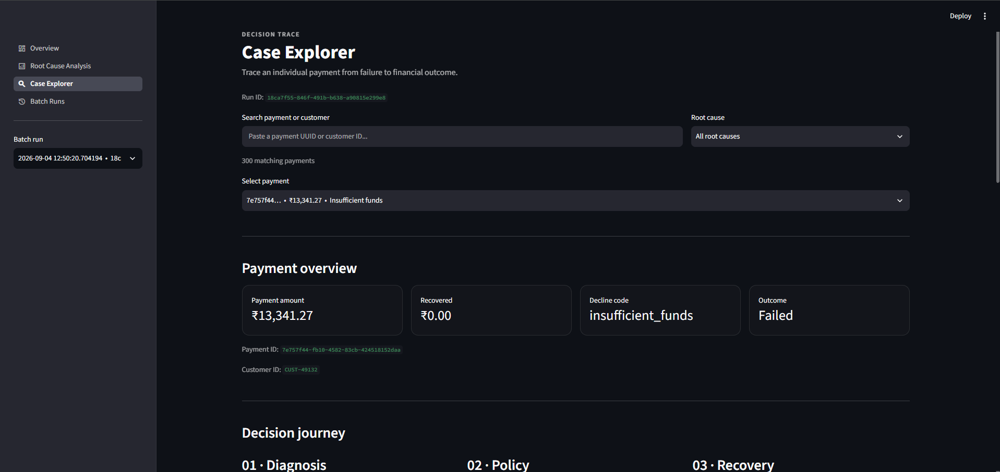
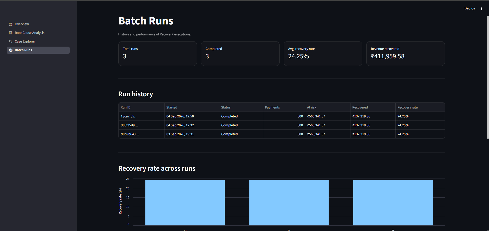
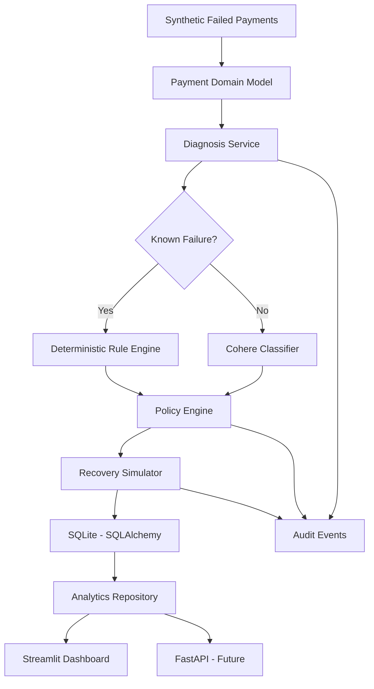

# RecoverX

### AI-Assisted Subscription Payment Recovery Simulator


RecoverX is an AI-assisted payment recovery decision system that diagnoses failed subscription payments, applies deterministic safety policies, uses Cohere to reason about ambiguous failures, simulates recovery actions, records an auditable decision trail, and provides run-level financial analytics through a Streamlit dashboard.

> **The LLM diagnoses ambiguity; deterministic policy controls what the system is actually allowed to do.**

---

## Dashboard Preview

> Add screenshots to `docs/images/` to polish the repository. Placeholders below show the expected layout.

```text
docs/
└── images/
    ├── overview.png
    ├── root-cause.png
    ├── case-explorer.png
    └── batch-runs.png
```

```md
## Dashboard Preview

### Overview


### Root Cause Analysis


### Case Explorer


### Batch Runs

```

If the images are not yet captured, the dashboard can be launched locally via `uv run streamlit run dashboard/app.py` and screenshots taken at `http://localhost:8501`.

---

## Problem

Recurring subscription payments frequently fail because of issues such as:

- insufficient funds
- expired cards
- transient network failures
- hard declines
- soft declines
- fraud-related signals
- ambiguous issuer responses

Blindly retrying every failed payment is unsafe and inefficient. Some failures should be retried immediately, some should wait, some should trigger a payment-method update, and some — especially fraud — should never be retried automatically.

RecoverX explores a **policy-constrained recovery workflow** where each failed payment is diagnosed, evaluated against explicit recovery rules, and then either recovered, retried, stopped, or escalated for review.

---

## Solution

RecoverX processes failed subscription payments through a closed-loop workflow:

```
Payment → Diagnosis → Policy Decision → Recovery Simulation → Audit Logging → Financial Analytics
```

| Stage | Responsibility |
|---|---|
| **Diagnosis** | Classifies the failure into a `RootCause` and recommends an action |
| **Policy** | Decides whether that action is *allowed* given safety constraints |
| **Recovery** | Simulates the outcome of an allowed action (no real money moves) |
| **Audit** | Appends chronological `diagnosis → policy → recovery` events with `run_id` |
| **Analytics** | Aggregates run-scoped financials and exposes them via API + Streamlit |

Each batch execution receives a unique `run_id`; all downstream artifacts are scoped to that `run_id`, so historical runs never contaminate each other.

---

## Architecture



**Layered layout:**

```text
app/
├── ai/               # Cohere classifier, prompts, schemas, cache
├── analytics/        # case_service (future)
├── core/             # config (pydantic-settings), database (SQLAlchemy), logging
├── domain/           # enums, models (Pydantic), policies (MAX_RETRIES, COOLDOWN_HOURS)
├── repositories/     # SQLAlchemy ORM + query repos (audit, diagnosis, recovery, payment, batch_run, analytics)
├── services/         # diagnosis, policy, recovery, pipeline orchestration
└── api/              # FastAPI routes (payments, recovery, metrics) - scaffolded
dashboard/
├── app.py            # st.navigation bootstrap + sys.path handling
├── data.py           # st.cache_data wrappers over AnalyticsRepository
├── ui.py             # display_label, format_inr, render_run_selector
└── pages/
    ├── overview.py
    ├── root_cause.py
    ├── case_explorer.py
    └── batch_runs.py
scripts/
├── generate_data.py  # synthetic_payments.csv (300 rows default)
├── run_pipeline.py   # deterministic batch execution
└── verify_integrity.py # run-level isolation checks
```

---

## Technology Stack

| Layer | Technology |
|---|---|
| Language | Python 3.14 (`requires-python = ">=3.14"` in `pyproject.toml`) |
| Package manager | `uv` (`uv sync`, `uv run`) |
| API framework | FastAPI `>=0.141.1` (scaffolded) |
| Validation | Pydantic `>=2.13.4` + `pydantic-settings` |
| AI | Cohere `>=7.0.9` (`command-a-plus-05-2026`) |
| Database | SQLite (`sqlite:///./recoverx.db` default) |
| ORM | SQLAlchemy `2.0.52` |
| Migrations | Alembic `1.19.1` |
| Dashboard | Streamlit `1.62.0` |
| Data processing | pandas `3.0.5`, plotly `6.9.0` (via Streamlit charts) |
| Testing | pytest `9.1.1` + `pytest-asyncio` |
| Type checking | mypy `2.3.1` |
| Linting | Ruff `0.16.4` |

No other badges are added — the stack above is exactly what `pyproject.toml` declares.

---

## AI Architecture

RecoverX intentionally uses a **hybrid diagnosis strategy** — it does *not* send every payment to the LLM.

### Deterministic path

`app/services/diagnosis_service.py:5` `RULE_TABLE`:

| `decline_code` | `RootCause` | `RecommendedAction` |
|---|---|---|
| `expired_card` | `EXPIRED_CARD` | `SEND_UPDATE_LINK` |
| `insufficient_funds` | `INSUFFICIENT_FUNDS` | `SMART_RETRY` |
| `network_error` | `TRANSIENT_GLITCH` | `IMMEDIATE_RETRY` |
| `fraud_suspected` | `FRAUD_FLAG` | `ESCALATE_MANUAL_REVIEW` |

These return `DiagnosisSource.RULE` with `confidence=1.0` and no LLM call.

### LLM path

Ambiguous decline codes miss the table and fall through to `CohereClassifier.classify()` in `app/ai/classifier.py:1`:

- Input: `Payment` context (`decline_code`, `amount`, `tenure`, `retry_count`, `plan`)
- Prompt: `app/ai/prompts.py`
- Schema: `app/ai/schemas.py` (structured `root_cause`, `confidence`, `recommended_action`, `reasoning`)
- Model: `COHERE_MODEL=command-a-plus-05-2026` (from `.env.example:5`)
- Cache: `data/llm_cache.db` via `app/ai/cache.py` to avoid duplicate calls

Returned fields:

```python
Diagnosis(
    root_cause=RootCause,
    confidence=float,
    source=DiagnosisSource.LLM,
    recommended_action=RecommendedAction,
    reasoning=str,
    model_name="command-a-plus-05-2026",
    prompt_version="v1",
    latency_ms=float,
)
```

This reduces unnecessary LLM calls, keeps known failure handling deterministic, and makes safety-critical policy decisions independent of unconstrained model output.

---

## Policy and Safety Boundaries

RecoverX does not allow the AI model to directly execute recovery actions. `app/services/policy_service.py` and `app/domain/policies.py` enforce hard constraints:

- fraud cases are never automatically retried (`FRAUD_FLAG → hard stop`)
- low-confidence diagnoses are escalated for review
- retry counts are capped per action
- recovery actions are explicitly allowlisted
- denied actions produce `RecommendedAction.STOP_NO_ACTION` with `RecoveryOutcome.PENDING` and `amount_recovered=0.0` — no automatic recovery

### Current limits

`app/domain/policies.py:3`:

| Action | Maximum retries |
|---|---:|
| `SMART_RETRY` | 3 |
| `IMMEDIATE_RETRY` | 2 |
| `SEND_UPDATE_LINK` | 1 |

`app/domain/policies.py:9`:

| Action | Cooldown |
|---|---:|
| `SMART_RETRY` | 48 hours |
| `IMMEDIATE_RETRY` | 1 hour |
| `SEND_UPDATE_LINK` | 72 hours |

Policy also checks `past_retry_count`, `customer_tenure_months`, and `confidence` before allowing an action. Denied actions are still audit-logged with `actor=policy_engine`, `decision`, and `policy_reason`.

---

## Recovery Simulation

Recovery is **simulated** rather than connected to a real processor, so strategies can be evaluated safely.

`app/services/recovery_service.py:10`:

| `RootCause` | Recovery probability |
|---|---:|
| `INSUFFICIENT_FUNDS` | 0.55 |
| `EXPIRED_CARD` | 0.70 |
| `HARD_DECLINE` | 0.10 |
| `SOFT_DECLINE` | 0.45 |
| `FRAUD_FLAG` | 0.00 |
| `TRANSIENT_GLITCH` | 0.85 |

- Retry penalty: `-0.10 × (attempt_number - 1)` capped to `[0.0, 0.95]`
- Deterministic demo pipeline uses `RANDOM_SEED = 42` in `scripts/run_pipeline.py:22` and `RecoverySimulator(rng=random.Random(42))`, so a 300-payment run is reproducible
- `RecoveryAttempt` records `run_id`, `payment_id`, `action_type`, `attempt_number`, `outcome` (`recovered` / `failed` / `pending`), `amount_recovered`, `timestamp`, `policy_reason`

Results should be interpreted as simulated performance, not real-world issuer behavior.

---

## Auditability and Run Tracking

Every pipeline execution receives a unique `run_id` (`BatchRunORM.run_id` UUID).

The run is associated with:

- `diagnoses` (`DiagnosisORM.run_id`)
- `recovery_attempts` (`RecoveryAttemptORM.run_id`)
- `audit_events` (`AuditEventORM.run_id`)

This enables run-level analysis and prevents historical batch executions from being mixed.

For an individual case, RecoverX reconstructs:

```
Payment → Diagnosis (run_id) → Policy (audit event run_id) → Recovery (run_id) → Audit trail (run_id)
```

Diagnosis records are run-scoped via `UniqueConstraint(run_id, payment_id)` at `app/repositories/orm_models.py:147` — the same `payment_id` can have different diagnoses in different runs.

`dashboard/data.py:158` `get_case_details(run_id, payment_id)` fetches all four layers with `get_by_run_and_payment(run_id, payment_id)` / `get_for_run_and_payment(run_id, payment_id)`, guaranteeing they belong to the same batch.

---

## Data Model

```text
batch_runs
   │  run_id (PK), started_at, completed_at, status
   ├── diagnoses  (FK run_id)
   ├── recovery_attempts (FK run_id)
   └── audit_events (FK run_id)

payments
   │  payment_id (PK), customer_id, amount, currency, decline_code, tenure, retry_count, failed_at, plan
   ├── diagnoses
   ├── recovery_attempts
   └── audit_events
```

### `batch_runs`
One execution of `scripts/run_pipeline.py`. Created in `PipelineService.run_batch()` via `BatchRunRepository`.

### `payments`
Failed subscription payments ingested from `data/synthetic_payments.csv`. Same synthetic `payment_id` is reused across runs (upserted), but downstream artifacts are distinct per `run_id`.

### `diagnoses`
`run_id + payment_id` unique, `root_cause`, `confidence`, `source` (`rule`/`llm`), `recommended_action`, `reasoning`, `model_name`, `prompt_version`, `latency_ms`.

### `recovery_attempts`
`run_id`, `payment_id`, `action_type`, `attempt_number`, `outcome`, `amount_recovered`, `policy_reason`.

### `audit_events`
`run_id`, `payment_id`, `event_type` (`diagnosis` / `policy_decision` / `recovery_attempt`), `actor` (`rule` / `cohere` / `policy_engine` / `recovery_simulator`), `decision`, `policy_reason`, `metadata_json` (`confidence`, etc.), `timestamp`.

### Migrations

- `a164327966a3_create_recoverx_tables.py`
- `b7c4e21a9f31_add_batch_runs_and_run_tracking.py`
- `c9d8f2a1e743_add_run_tracking_to_diagnoses.py`

---

## Dashboard

All pages are run-scoped via `dashboard/ui.py:69` `render_run_selector()` — the sidebar batch selector drives every query.

### Overview (`dashboard/pages/overview.py`)
Executive view:

- `Payments processed`, `Revenue at risk`, `Revenue recovered`, `Recovery rate` (from `get_run_summary`)
- `Recovery outcomes` (bar chart via `get_outcomes`)
- `Root cause distribution` (via `get_root_causes`)
- `Policy decisions` (`get_actions`)
- `Run statistics` `successful / failed / pending recoveries`
- Methodology expander: `revenue recovered / revenue at risk`

### Root Cause Analysis (`dashboard/pages/root_cause.py`)
Financial analysis by diagnosed failure type:

- `get_root_cause_financials()` → `payments`, `at_risk`, `recovered`, `recovery_rate` per `RootCause`
- `get_root_cause_insights()` → `Largest revenue exposure`, `Best recovery rate`, `Largest unrecovered opportunity` (`app/repositories/analytics_repository.py:638`)
- Charts: financial exposure (at risk vs recovered) and recovery effectiveness (`recovery_rate %`)
- Detailed table with INR/percent formatting via `dashboard/ui.py:48`

### Case Explorer (`dashboard/pages/case_explorer.py`)
Case-level investigation for a selected `payment_id`:

- Filters: `Search payment or customer` + `Root cause` dropdown
- `Payment overview` (amount, recovered, decline code, outcome)
- `Decision journey` 01 Diagnosis (root cause, source, confidence progress), 02 Policy (decision, reason, allowed/blocked), 03 Recovery (action, outcome, amount)
- `Diagnosis reasoning` (Cohere vs rule, model/prompt/latency)
- `Recovery history` dataframe
- `Audit trail` expanders (actor, decision, policy_reason, metadata JSON)
- All fetched via `get_case_details(run_id, payment_id)` — run-scoped.

### Batch Runs (`dashboard/pages/batch_runs.py`)
Historical execution analysis:

- `get_run_metrics()` → `Total runs`, `Completed`, `Avg recovery rate`, `Revenue recovered`
- `Run history` table (Run ID, Started, Status, Payments, At risk, Recovered, Recovery rate)
- `Recovery rate across runs` and `Revenue recovered across runs` bar charts

---

## Example Results

**Latest verified 300-payment simulation** (`scripts/run_pipeline.py:22` `RANDOM_SEED=42`, `data/synthetic_payments.csv`):

| Metric | Result |
|---|---:|
| Run ID | `d85f35d9-aad1-4bc4-b348-d657fee94195` |
| Payments processed | 300 |
| Revenue at risk | ₹566,341.57 |
| Revenue recovered | ₹137,319.86 |
| Recovery rate | 24.25% |
| Rule diagnoses | 224 |
| Cohere diagnoses | 76 |
| Successful recoveries | 70 |
| Failed recoveries | 77 |
| Pending recoveries | 153 |
| Manual escalations | 153 |
| Fraud hard stops | 35 |
| Retry exhaustion | 118 |

Breakdown by root cause (`get_root_cause_financials`):

| Root cause | Payments | At risk | Recovered | Recovery rate |
|---|---:|---:|---:|---:|
| insufficient_funds | 93 | ₹194,804.00 | ₹47,712.09 | 24.49% |
| expired_card | 68 | ₹118,935.03 | ₹34,190.60 | 28.75% |
| hard_decline | 47 | ₹77,655.42 | ₹9,098.36 | 11.72% |
| fraud_flag | 35 | … | … | 0% |
| transient_glitch | 34 | … | … | 73.89% (best) |
| soft_decline | 23 | … | … | 45% |

> These results come from the deterministic simulation configuration and should be interpreted as simulated recovery performance, not real-world payment recovery benchmarks.

---

## Project Structure

```text
RecoverX/
│
├── app/
│   ├── ai/
│   │   ├── cache.py
│   │   ├── classifier.py
│   │   ├── cohere_client.py
│   │   ├── prompts.py
│   │   └── schemas.py
│   ├── analytics/
│   │   └── case_service.py
│   ├── api/
│   │   └── routes/
│   ├── core/
│   │   ├── config.py          # pydantic-settings, COHERE_MODEL, DATABASE_URL
│   │   └── database.py        # SessionLocal, init_db
│   ├── domain/
│   │   ├── enums.py
│   │   ├── models.py          # Pydantic Payment/Diagnosis/PolicyDecision/RecoveryAttempt
│   │   └── policies.py        # MAX_RETRIES, COOLDOWN_HOURS
│   ├── repositories/
│   │   ├── analytics_repository.py  # RunSummary, RootCauseFinancialMetric, RunMetrics, CaseSummary, RootCauseInsight
│   │   ├── audit_repository.py
│   │   ├── batch_run_repository.py
│   │   ├── diagnosis_repository.py
│   │   ├── orm_models.py      # BatchRunORM, PaymentORM, DiagnosisORM, RecoveryAttemptORM, AuditEventORM
│   │   ├── payment_repository.py
│   │   └── recovery_repository.py
│   └── services/
│       ├── diagnosis_service.py
│       ├── pipeline_service.py
│       ├── policy_service.py
│       └── recovery_service.py
│
├── dashboard/
│   ├── app.py                 # st.navigation + ROOT_DIR sys.path bootstrap
│   ├── data.py                # st.cache_data wrappers (get_case_details, get_run_metrics, get_root_cause_insights, ...)
│   ├── ui.py                  # LABELS, display_label, format_inr, render_run_selector
│   └── pages/
│       ├── overview.py
│       ├── root_cause.py
│       ├── case_explorer.py
│       └── batch_runs.py
│
├── alembic/
│   ├── env.py
│   └── versions/
│       ├── a164327966a3_*.py
│       ├── b7c4e21a9f31_*.py
│       └── c9d8f2a1e743_*.py
│
├── data/
│   ├── synthetic_payments.csv       # 300-row input
│   └── llm_cache.db                # Cohere response cache (gitignored)
│
├── scripts/
│   ├── generate_data.py
│   ├── run_pipeline.py              # RANDOM_SEED=42
│   ├── verify_integrity.py          # run-level isolation checks
│   └── test_pipeline.py
│
├── tests/
│   ├── integration/test_database.py
│   └── unit/
│       ├── test_analytics_repository.py
│       ├── test_diagnosis_service.py
│       ├── test_pipeline_service.py
│       ├── test_policy_service.py
│       ├── test_recovery_service.py
│       ├── test_root_cause_financials.py
│       ├── test_root_cause_insights.py
│       └── test_run_metrics.py
│
├── docs/
│   └── images/               # overview.png, root-cause.png, case-explorer.png, batch-runs.png
├── .env.example
├── .gitignore
├── alembic.ini
├── pyproject.toml
└── uv.lock
```

---

## Getting Started

### Prerequisites

- Python 3.14+ (`python --version`)
- `uv` (`pip install uv` or `pipx install uv`)
- Cohere API key (`https://cohere.com`)

```bash
git clone https://github.com/TanayKumar-V2/RecoverX.git
cd RecoverX
uv sync
```

Create environment file:

```bash
# bash / macOS
cp .env.example .env

# PowerShell
Copy-Item .env.example .env
```

Edit `.env`:

```env
COHERE_API_KEY=your_api_key_here
COHERE_MODEL=command-a-plus-05-2026
DATABASE_URL=sqlite:///./recoverx.db
```

---

## Database Setup

Run the latest Alembic migration:

```bash
uv run alembic upgrade head
```

Verify:

```bash
uv run alembic current
# → a164327966a3, b7c4e21a9f31, c9d8f2a1e743 (head)
```

To reset (demo-only):

```bash
rm recoverx.db
uv run alembic upgrade head
```

---

## Generate Synthetic Data

```bash
uv run python -m scripts.generate_data
# → data/synthetic_payments.csv (300 rows, deterministic seed)
```

Schema: `payment_id, customer_id, amount, currency, decline_code, customer_tenure_months, past_retry_count, failed_at, subscription_plan`

---

## Run the Pipeline

```bash
uv run python -m scripts.run_pipeline
```

This:

- Loads `data/synthetic_payments.csv`
- Creates a `batch_runs` entry with `run_id` UUID
- Diagnoses each payment (`rule` vs `cohere`)
- Applies `PolicyService` with `MAX_RETRIES` / `COOLDOWN_HOURS`
- Simulates recovery via `RecoverySimulator(RANDOM_SEED=42)`
- Persists `diagnoses`, `recovery_attempts`, `audit_events` with `run_id`
- Prints:

```text
Run ID:                  d85f35d9-aad1-4bc4-b348-d657fee94195
Payments processed:     300
At-risk revenue:        INR 566,341.57
Recovered revenue:      INR 137,319.86
Recovery rate:          24.25%
Rule diagnoses:         224
Cohere diagnoses:       76
...
```

---

## Verify Integrity

```bash
uv run python -m scripts.verify_integrity
# or
uv run python verify_integrity.py  # wrapper at repo root
```

The script (also used for manual audit before) validates:

- run-level KPI consistency (`get_run_metrics` vs `get_run_summary` vs raw `AnalyticsRepository`)
- root-cause financial reconciliation (sum `at_risk` == `total_at_risk`)
- batch isolation (distinct `run_id`, independent metrics)
- run-scoped diagnosis records (`uq_diagnoses_run_payment`)
- run-scoped recovery attempts
- run-scoped audit events
- case-level cross-run isolation (same `payment_id` in two runs yields different `run_id` artifacts)

Example output:

```text
OVERVIEW PASS
ROOT CAUSE PASS
BATCH RUNS PASS
CASE EXPLORER PASS
==============================================
          ALL INTEGRITY CHECKS PASSED
==============================================
```

Fundamental guarantee checked: for a sampled payment (`6043264e-...` in `d85f35d9`):

```
Diagnosis run_id → d85f35d9 ✔
Policy audit run_id → d85f35d9 ✔
Recovery run_id → d85f35d9 ✔
Audit trail run_id → d85f35d9 ✔
```

---

## Testing

```bash
uv run ruff check .
uv run mypy app
uv run pytest
```

Current status (after `22` tests):

```text
tests/integration/test_database.py .
tests/unit/test_analytics_repository.py ...
tests/unit/test_diagnosis_service.py ..
tests/unit/test_pipeline_service.py ..
tests/unit/test_policy_service.py .......
tests/unit/test_recovery_service.py ....
tests/unit/test_root_cause_financials.py .
tests/unit/test_root_cause_insights.py .
tests/unit/test_run_metrics.py .
============================= 22 passed in 0.92s ==============================
```

Static checks:

```bash
uv run ruff check .
# → All checks passed!

uv run mypy app
# → Success: no issues found in 39 source files
```

Testing philosophy:

- **Unit tests** validate diagnosis, policy, recovery, and analytics logic in isolation
- **Integration tests** validate persistence (SQLAlchemy + SQLite)
- **Integrity checks** (`verify_integrity.py`) validate run-level isolation and cross-layer consistency — the strongest correctness signal for this project
- **Static checks** enforce type safety and linting

---

## Launch Dashboard

```bash
uv run streamlit run dashboard/app.py
# → Local URL: http://localhost:8501
```

`dashboard/app.py:3-10` bootstraps `ROOT_DIR` onto `sys.path` so that `from dashboard.data import ...` and `from app.repositories...` resolve when launched via `streamlit run`. If you see `ModuleNotFoundError: No module named 'dashboard'`, restart Streamlit after `git pull`.

**Four flows to verify:**

1. **Overview** → select latest run → verify `Payments processed / Revenue at risk / Recovered / Recovery rate` match the pipeline printout
2. **Root Cause Analysis** → `Financial exposure` (at risk vs recovered), `Recovery effectiveness` (`recovery_rate %`), `Root cause performance` table — should sum to overview totals
3. **Case Explorer** → select run → filter → select payment → verify `Diagnosis` (rule/Cohere reasoning, confidence), `Policy decision` (allowed/blocked), `Recovery history`, `Audit trail` — all should show same `Run ID`
4. **Batch Runs** → `Total runs / Completed / Avg recovery / Revenue recovered`, `Run history` table, `Recovery rate across runs` charts — each run should have independent metrics

> **Integrity spot-check:** pick a payment from your latest run in Case Explorer and confirm `Diagnosis run_id == Policy audit run_id == Recovery run_id == Audit trail run_id`.

---

## Configuration

| Variable | Required | Default | Description |
|---|:---:|---|---|
| `COHERE_API_KEY` | Yes | — | Cohere API credential for LLM path |
| `COHERE_MODEL` | No | `command-a-plus-05-2026` | Model used in `app/ai/classifier.py` |
| `DATABASE_URL` | No | `sqlite:///./recoverx.db` | SQLAlchemy URL (Alambique + `SessionLocal`) |
| `APP_NAME` | No | `RecoverX` | Display name |
| `APP_ENV` | No | `development` | Environment flag |
| `LOG_LEVEL` | No | `INFO` | Logging |

---

## Design Decisions

### Why hybrid rules + LLM?

Known failure modes are deterministic and should not require an LLM. The LLM is reserved for ambiguous cases where a structured `root_cause + confidence + reasoning` adds value. This also bounds cost and latency.

### Why doesn't Cohere directly decide whether to retry?

Recovery execution is controlled by an explicit `PolicyService` so model output cannot bypass safety constraints. The LLM proposes; policy disposes. This is the `policy-constrained` core of RecoverX.

### Why SQLite?

SQLite is sufficient for a local simulation and keeps the project self-contained while still allowing SQLAlchemy/Alembic-based persistence. Migration to PostgreSQL is straightforward (change `DATABASE_URL`, re-run `alembic upgrade head`).

### Why `run_id`?

A batch execution is a first-class analytical boundary. `run_id` allows historical executions to be independently inspected and compared, and guarantees case-level traces are not polluted across runs. Without it, `latest diagnosis` would leak across batches.

### Why simulate recovery?

The project demonstrates decision architecture without touching real payment systems or moving real money. Simulation with configurable probabilities and a fixed seed makes results reproducible and reviewable.

---

## Limitations

- Recovery outcomes are **simulated** rather than connected to a payment processor
- Synthetic payment data (`synthetic_payments.csv`) is used — no real customer data
- SQLite is intended for local/demo usage (single-writer)
- Cohere classification is only used for ambiguous cases (~25% of the 300-row set)
- The simulator does not represent real-world issuer behavior, network effects, or fraud models
- No real customer communication or payment mutation occurs
- Charts are Streamlit-native (no custom D3) and `llm_cache.db` is local-only

Acknowledging these makes the simulated `24.25%` recovery rate credible as a *simulated* benchmark, not a production claim.

---

## Future Work

- Add additional recovery strategies (e.g., `dunning` schedule, `payment-method` update reminder)
- Introduce richer policy configuration (YAML + admin UI)
- Add experiment / A-B testing for recovery strategies
- Add model evaluation metrics for ambiguous cases (precision/recall per `RootCause`)
- Replace SQLite with PostgreSQL for multi-user deployment
- Add authentication and role-based dashboard access
- Integrate with a payment processor sandbox (Stripe test mode)
- Add scheduled batch execution (cron / APScheduler)
- Add `docs/images` screenshots and GitHub Pages demo

---

## License

MIT License — add a `LICENSE` file to the repository root if you choose this license.

```text
MIT License

Copyright (c) 2026 Tanay Kumar

Permission is hereby granted...
```

Do not claim MIT in `pyproject.toml` or `README` without the actual file.

---

## Author

**Tanay Kumar**

Computer Science & Engineering Student

- GitHub: `https://github.com/TanayKumar-V2`
- LinkedIn: *(add your LinkedIn)*
- Email: `tanayk726@gmail.com`

Project: `RecoverX` (repo) / `RecoverX` (product)

---

## README's overall flow

```text
1.  RecoverX (hero)
2.  Dashboard Preview
3.  Problem Statement
4.  Solution
5.  Architecture
6.  Technology Stack
7.  AI Architecture
8.  Policy & Safety
9.  Recovery Simulation
10. Auditability & Run Tracking
11. Data Model
12. Dashboard
13. Example Results
14. Project Structure
15. Getting Started
16. Database Setup
17. Generate Data
18. Run Pipeline
19. Verify Integrity
20. Testing
21. Launch Dashboard
22. Configuration
23. Design Decisions
24. Limitations
25. Future Work
26. License
27. Author
```

> RecoverX simulates policy-constrained payment recovery and reports simulated recovered revenue.
